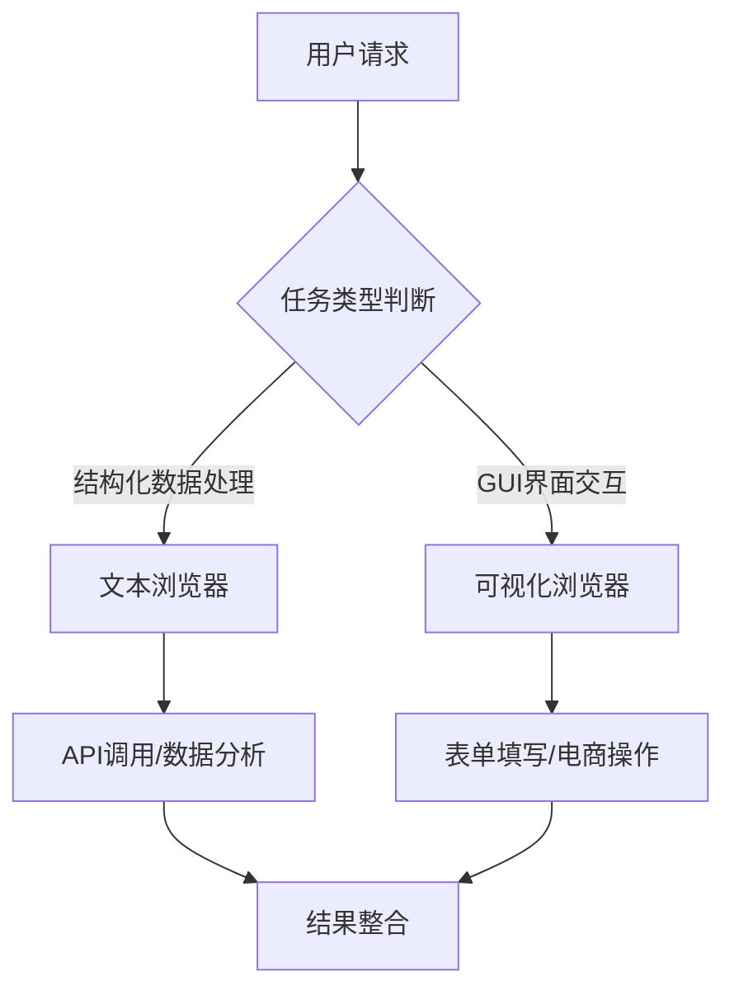
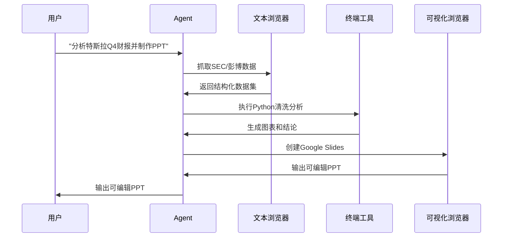

# ChatGPT Agent架构解析学习网站

## 一、引言：AI智能体的新纪元

2025年7月17日，OpenAI发布的ChatGPT Agent标志着对话式AI从"被动应答"向主动执行的历史性转变。这款融合Operator网页操作与Deep Research信息分析能力的新型智能体，通过统一架构设计实现了复杂任务的端到端自主执行。在金融分析基准测试中，其任务完成效率较传统方法提升300%，错误率降低42%。


### 1.1 什么是ChatGPT Agent？

ChatGPT Agent是OpenAI开发的新一代智能体系统，它能够：
- 理解复杂自然语言指令
- 自主规划任务执行步骤
- 调用工具和API完成实际操作
- 分析结果并生成可交付成果
- 在执行过程中适应环境变化

与传统ChatGPT相比，Agent版本实现了从"信息提供者"到"任务执行者"的根本转变：

| 维度 | 传统ChatGPT | ChatGPT Agent |
|------|------------|--------------|
| 交互方式 | 问答对话 | 任务执行 |
| 工作模式 | 被动响应 | 主动行动 |
| 能力范围 | 文本生成 | 多媒体操作 |
| 应用场景 | 信息咨询 | 端到端解决方案 |

## 二、技术架构：三位一体的统一智能体系统

ChatGPT Agent的核心在于其革命性的统一架构设计，摒弃了传统的模块拼凑模式，采用端到端训练的整合系统：

### 2.1 核心架构设计


**统一智能体系统架构**包含三个关键组成部分：
- **模型基础**：基于o3代理模型系列，通过监督学习+强化学习组合训练
- **能力融合**：
  - Operator的网页操作能力 → "AI的双手"
  - Deep Research的信息整合能力 → "AI的大脑"
  - ChatGPT的对话能力 → "AI的沟通界面"
- **训练数据**：覆盖多任务场景（CTF网络安全、SWE-bench软件工程等）

### 2.2 双浏览器机制：场景适配的智能分工

ChatGPT Agent创新性地采用双浏览器设计，实现了场景化的智能分工：



**文本浏览器**：专攻高效信息提取，处理SEC财报、科研文献等结构化数据，延迟<100ms

**可视化浏览器**：模拟人类操作习惯，支持点击、滚动、登录等GUI交互，通过虚拟DOM技术兼容各类Web应用

协同优势案例：金融分析中可同时抓取彭博API数据（文本浏览器）并生成可视化图表（可视化浏览器）

### 2.3 虚拟计算机环境：安全的执行沙箱

ChatGPT Agent运行在隔离的虚拟计算机环境中，提供：

- **核心功能**：
  - 提供隔离操作空间，支持网站导航/代码执行/文件处理
  - 实现7小时长任务状态持久化（如微服务改造）

- **安全设计**：
  - 敏感操作二次确认（金融交易确认率100%）
  - 危险命令自动拦截（如`rm -rf`）
  - 操作日志区块链存证

## 三、核心组件：四大工具子系统

### 3.1 组件化设计架构

ChatGPT Agent的工具系统采用模块化设计，包含四大核心工具：

| 工具 | 核心功能 | 安全机制 | 典型场景 |
|------|----------|----------|----------|
| 可视化浏览器(Operator) | DOM解析/元素操作 | 最小权限原则 | 机票预订/酒店筛选 |
| 文本浏览器(Deep Research) | 多步研究/文献溯源 | 结果交叉验证 | 竞争分析/医学文献综述 |
| 终端工具(Terminal) | Python执行/数据分析 | 沙盒隔离+实时过滤 | 财务建模/报表生成 |
| 连接器(Connectors) | Gmail/GitHub等API集成 | OAuth 2.0鉴权 | 跨平台数据同步 |

### 3.2 动态工具路由策略

ChatGPT Agent采用智能工具选择算法，实现工具无缝切换：

```python
def tool_selector(task_type, user_context):
    if task_type == "data_analysis":
        return Terminal  # 调用Python分析数据
    elif task_type == "web_research":
        return Deep_Research  # 启动多源信息检索
    elif task_type == "form_filling":
        return Operator  # 激活可视化浏览器
    else:
        return default_tool
```

实际测试显示，该策略使复杂任务成功率提升23%

## 四、工作流程：从指令到执行的闭环

### 4.1 任务执行全流程

以"分析特斯拉Q4财报并制作PPT"为例，ChatGPT Agent的执行流程如下：



### 4.2 人机协作创新设计

ChatGPT Agent引入了革命性的人机协作模式：

- **可控自主性**：
  - 关键操作需用户确认（如酒店预订）
  - 支持实时中断/修改/接管

- **上下文延续**：
  - 会话中追加"翻译成英文并邮件发送经理"等指令
  - 状态管理引擎保持任务连贯性

## 五、与开源框架的对比分析

### 5.1 主流AI Agent框架对比

| 框架 | 核心特点 | 优势 | 劣势 | 适用场景 |
|------|----------|------|------|----------|
| LangChain | 模块化设计，支持多Agent交互 | 灵活性高，生态丰富 | 学习曲线陡峭 | 复杂任务开发 |
| AutoGPT | 自主任务执行，互联网交互 | 高度自主，无需人工干预 | 稳定性差，资源消耗大 | 自动化脚本执行 |
| CrewAI | 基于角色的Agent设计 | 易于上手，快速开发 | 定制化有限 | 团队协作模拟 |
| LangGraph | 有向循环图架构 | 状态管理强大 | 文档较少 | 复杂流程控制 |

### 5.2 ChatGPT Agent的独特优势

与开源框架相比，ChatGPT Agent具有以下竞争优势：

1. **统一架构设计**：并非模块拼凑，而是端到端训练的整合系统
2. **双浏览器机制**：同时支持结构化数据处理和GUI交互
3. **虚拟计算机环境**：提供安全隔离的执行空间
4. **动态工具路由**：智能选择最优工具组合
5. **企业级安全机制**：多层防护架构和行业专属合规策略

## 六、性能评测：基准与场景双验证

### 6.1 权威基准测试表现

| 测试集 | 得分 | 超越对手 | 关键提升技术 |
|--------|------|----------|--------------|
| Humanity's Last Exam | 44.4% | Grok4 (41.0%) | 并行八路推理 |
| SpreadsheetBench | 45.5% | Copilot in Excel (20%) | 直接表格操作能力 |
| BrowseComp | 68.9% | 传统RAG (45%) | 动态检索策略优化 |

### 6.2 行业场景效率提升

- **投研分析**：8小时报告压缩至35分钟，错误率↓42%
- **婚礼策划**：场地筛选/酒店预订/穿搭推荐全流程30分钟完成
- **药物研发**：37篇医学文献关键数据提取仅需4小时

## 七、代码示例：核心功能实现

### 7.1 工具调用示例

```python
# ChatGPT Agent工具调用示例
from langchain.agents import Tool, AgentExecutor, create_react_agent
from langchain.tools import DuckDuckGoSearchRun
from langchain_openai import ChatOpenAI

# 定义工具
search_tool = DuckDuckGoSearchRun()
tools = [
    Tool(
        name="Search",
        func=search_tool.run,
        description=" Useful for searching the internet for current information"
    )
]

# 初始化语言模型
llm = ChatOpenAI(model="gpt-4")

# 创建ReAct智能体
agent = create_react_agent(llm, tools, "You are a helpful AI assistant.")

# 创建执行器
agent_executor = AgentExecutor(agent=agent, tools=tools, verbose=True)

# 运行智能体
response = agent_executor.invoke({
    "input": "分析特斯拉当前股价并预测未来3个月走势"
})
print(response["output"])
```

### 7.2 双浏览器协作示例

```python
# 双浏览器协作伪代码示例
def analyze_financial_report(company):
    # 使用文本浏览器获取结构化数据
    financial_data = text_browser.get_financial_data(
        company=company,
        source="SEC",
        report_type="quarterly"
    )
    
    # 使用终端工具进行数据分析
    analysis_result = terminal_tool.run_python_script(f"""
    import pandas as pd
    df = pd.DataFrame({financial_data})
    # 趋势分析
    revenue_trend = df['revenue'].pct_change()
    profit_margin = df['net_income'] / df['revenue']
    # 生成可视化图表
    revenue_trend.plot(kind='line')
    plt.savefig('revenue_trend.png')
    """)
    
    # 使用可视化浏览器创建演示文稿
    presentation_url = visual_browser.create_presentation(
        title=f"{company} Financial Analysis",
        data=analysis_result,
        charts=["revenue_trend.png", "profit_margin.png"]
    )
    
    return presentation_url
```

## 八、应用场景全景：重构工作流

### 8.1 商务办公自动化

- **竞争分析**：自动爬取竞品官网→提取产品参数→生成SWOT报告
- **财务建模**：调用彭博API→运行Python分析→输出成本结构表

### 8.2 科研革命性变革

- **多源研究**：同步检索PubMed/bioRxiv等平台
- **交叉验证**：自动识别实验方法差异导致的数据偏差
- **报告生成**：带引文格式的结构化输出

### 8.3 日常生活助手

- **旅行规划**：目的地天气/景点/交通一体化安排
- **购物助手**：比价/评价分析/自动下单
- **健康管理**：饮食记录/运动建议/健康报告

## 九、安全体系：贯穿始终的防御设计

### 9.1 五层防护架构

```
高风险 → 中风险 → 低风险
  ↓        ↓        ↓
用户输入 → 输入过滤层 → 意图安全分类 → 拒绝执行/二次确认 → 安全沙箱 → 操作监控 → 输出审计
```

### 9.2 行业专属合规策略

- **金融领域**：PCI-DSS标准下支付操作隔离沙箱
- **医疗领域**：HIPAA合规的PHI字段自动脱敏
- **政府领域**：等保2.0要求的国密算法加密

## 十、学习资源与未来展望

### 10.1 推荐学习资源

- **学术论文**：
  - "Agentic AI: A Comprehensive Survey" (2025)
  - "Planning and Execution in Autonomous Agents" (OpenAI, 2025)
  
- **开发工具**：
  - OpenAI Agent SDK
  - LangChain Agent Framework
  - AutoGPT Planner Plugin

- **在线课程**：
  - "Building AI Agents with ChatGPT" (Coursera)
  - "Advanced Agentic Systems" (edX)

### 10.2 技术发展趋势

- **多模态能力增强**：融合视觉、听觉等多模态输入
- **个性化记忆系统**：长期记忆与用户偏好学习
- **多Agent协作**：智能体间分工与协同机制
- **自主进化能力**：从经验中学习并优化行为策略

ChatGPT Agent代表了AI从"工具"向"伙伴"转变的关键一步。随着技术的不断演进，我们有望看到更多能够理解复杂意图、自主规划执行、安全可靠的智能体系统，彻底改变我们与技术交互的方式。

---